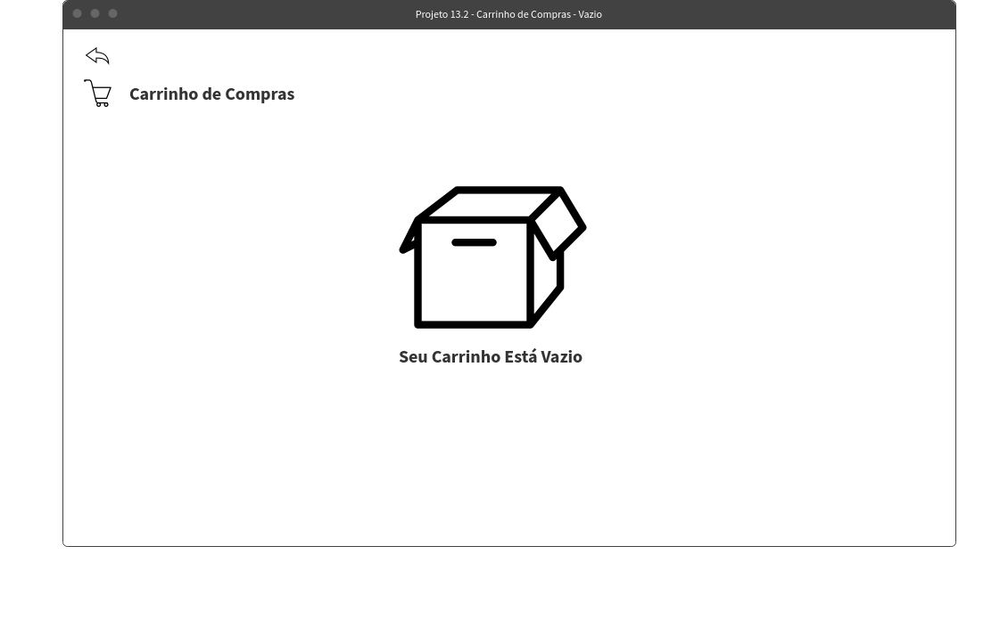
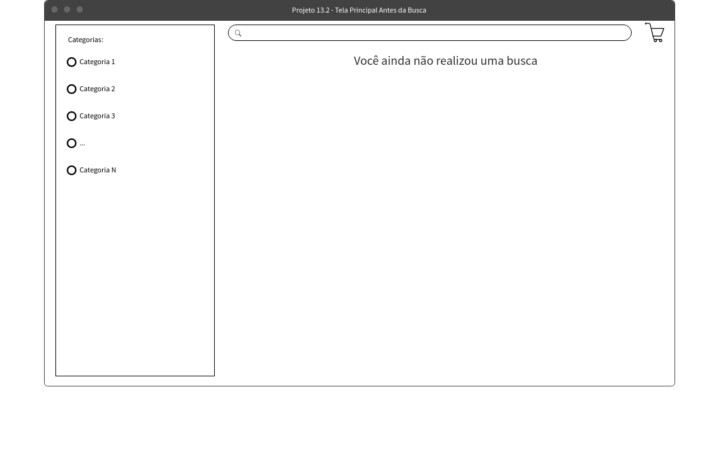
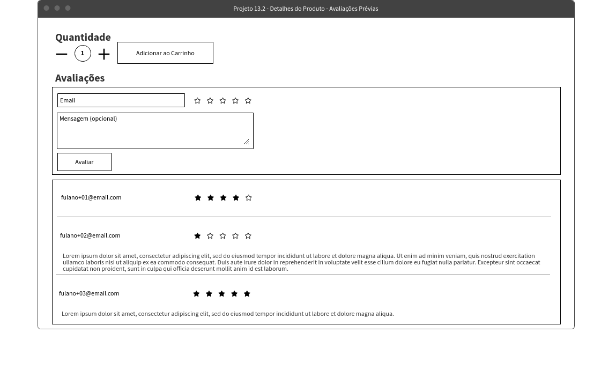
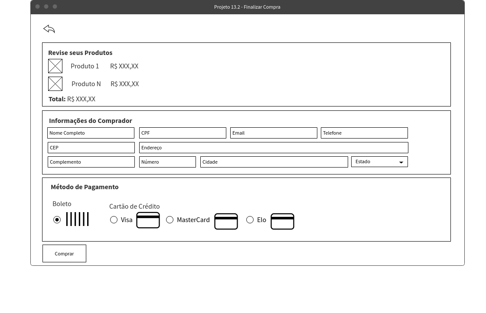
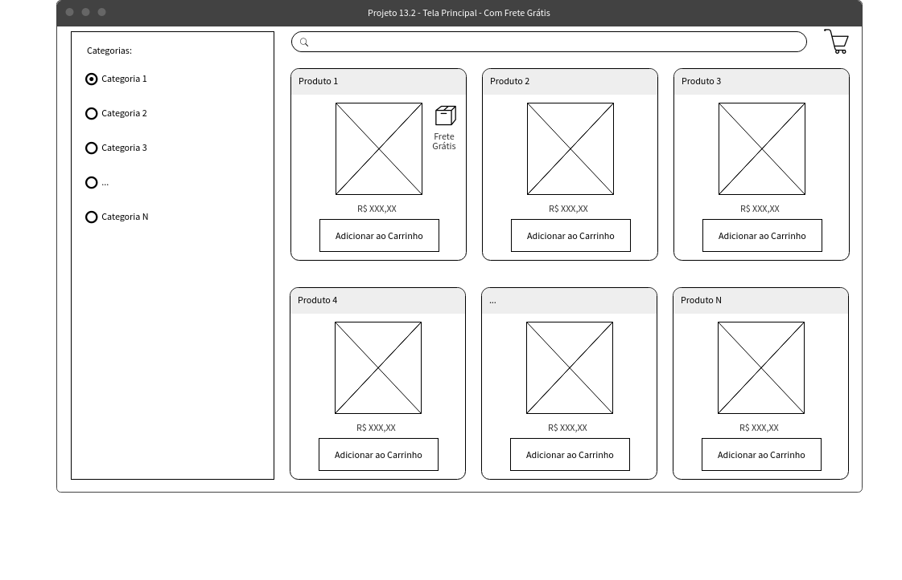
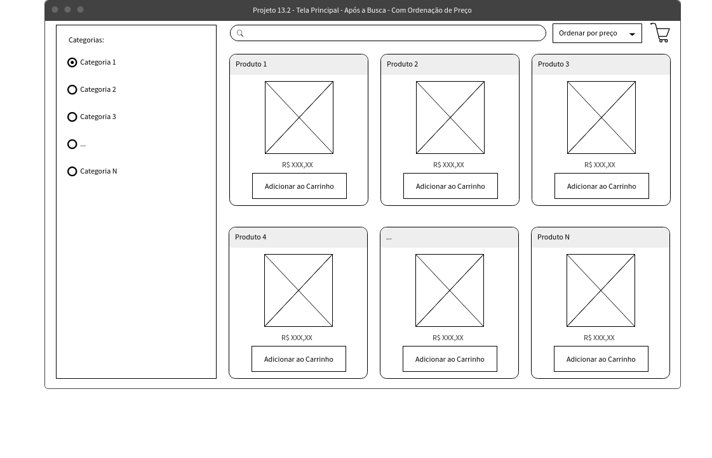

# Boas-vindas ao repositório do projeto Front-End Online Store!
# Requisitos
## 1. Implemente o módulo de acesso à api do Mercado Livre

**PRIORIDADE 0** 

<details>
<summary>Implemente um módulo que acessa a API do Mercado Livre:</summary>

- Utilize (**OBRIGATORIAMENTE**) o arquivo `src/services/api.js` para acessar a API do Mercado Livre em sua aplicação;
- Utilize (**OBRIGATORIAMENTE**) o módulo **[Fetch](https://developer.mozilla.org/en-US/docs/Web/API/Fetch_API/Using_Fetch)** para realizar as requisições;
- <details><summary>Você deve (<b>OBRIGATORIAMENTE</b>) implementar as funções <code>getCategories()</code> e <code>getProductsFromCategoryAndQuery()</code> que estão no arquivo <code>src/services/api.js</code>:</summary>

  ```javascript
  export async function getCategories() {
    // Implemente aqui
  }

  export async function getProductsFromCategoryAndQuery(/* categoryId, query */) {
    // Implemente aqui! Quando o fizer, descomente os parâmetros que essa função recebe
    // Essa função será chamada em vários momentos do projeto para buscar os produtos pela categoria e querys
    // Dentro da função você pode usar condicionais definir qual API utilizar
  }
  ```
  Essas funções devem realizar uma chamada para a [API do Mercado Livre](#-Documentação-da-API-do-Mercado-Livre) e retornar uma [Promise](https://developer.mozilla.org/en-US/docs/Web/JavaScript/Reference/Global_Objects/Promise) com os dados de resultado. Com essa implementação, o uso dessas funções deve ser algo parecido com o exemplo abaixo:

  ```javascript
  import * as api from './services/api'

  api.getCategories().then(categories => { console.log(categories) })
  ```

  A variável `categories` deve conter o objeto JSON com as categorias obtidas através da chamada da API do Mercado Livre:

  ```json
  [
    {
        "id": "MLB5672",
        "name": "Acessórios para Veículos"
    },
    {
        "id": "MLB271599",
        "name": "Agro"
    },
    {
        "id": "MLB1403",
        "name": "Alimentos e Bebidas"
    }
  ]
  ```
  </details>
  
- Sinta-se livre para criar novas funções neste arquivo, mas apenas as funções <code>getCategories()</code> e <code>getProductsFromCategoryAndQuery()</code> serão avaliadas.
</details><br />

<details>
  <summary><strong>O que será verificado</strong></summary>

  - Implementa a função `getCategories`;
  - Implementa a função `getProductsFromCategoryAndQuery`.
</details>

---

## 2. Crie uma página de listagem de produtos vazia

**PRIORIDADE 0** 

A tela principal da plataforma é a de **listagem de produtos**, onde a pessoa usuária poderá buscar produtos para adicionar ao carrinho, além de filtrar suas buscas.

<details><summary>Crie o campo de busca da tela principal, que será utilizado para listar os produtos encontrados:</summary>

  * Esta página deve ficar no path `/`, renderizável a partir do acesso ao componente `<App />`;
  * Inicialmente a listagem de produtos deve estar vazia;
  * Quando a lista estiver vazia, a página deve mostrar a mensagem `"Digite algum termo de pesquisa ou escolha uma categoria."`;
  * Adicione o atributo `data-testid` com o valor `home-initial-message` no elemento da mensagem.
</details>

<details><summary><b>Exemplo de página de listagem de produtos antes da busca</b></summary>
  
  A imagem pode ser acessada no arquivo `./wireframes/card_02.png`

  
</details><br />

<details>
  <summary><strong>O que será verificado</strong></summary>

  - A raiz da aplicação, em `<App />`, renderiza com sucesso;
  - A tela contém a mensagem pedida: 'Digite algum termo de pesquisa ou escolha uma categoria.'.
</details>

---

## 3. Crie a página do carrinho de compras

**PRIORIDADE 1**

A pessoa usuária poderá adicionar produtos em seu carrinho de compras, a partir da listagem dos produtos.

Crie uma tela que representará o carrinho de compras da aplicação. Além disso, na tela principal, crie um botão que redireciona à página do carrinho de compras. Inicialmente, o carrinho deve estar vazio.

<details><summary> Crie uma tela que represente o carrinho de compras:</summary>

  * Quando não existirem produtos no carrinho de compras, a página deve exibir a mensagem `"Seu carrinho está vazio"`;
  * Adicione o atributo `data-testid` com o valor `shopping-cart-empty-message` no elemento da mensagem.

  <details><summary><b>Exemplo da tela Carrinho de Compras</b></summary>

    
  </details>
</details>

<details><summary> Na tela principal, crie um elemento que redirecione a pessoa usuária à página do carrinho de compras:</summary>

  * O elemento deve estar visível na página inicial (listagem de produtos);
  * Este elemento também deverá estar presente na página de detalhes de um produto, mas não se preocupe com isso neste momento, estará descrito em um requisito posterior;
  * Adicione o atributo `data-testid` com o valor `shopping-cart-button` no elemento que redireciona à pagina de carrinho de compras. 
  
  :warning: **Atenção!** O **elemento** que faz o direcionamento para a página do carrinho é quem deve conter o `data-testid`. Se você fizer isso com um `<Link />`, por exemplo, é este quem deve conter o `data-testid`.

  <details><summary><b>Exemplo da tela principal com o elemento que redireciona para a tela do carrinho:</b></summary>

    
  </details>
</details><br />

<details>
  <summary><strong>O que será verificado</strong></summary>

  - A home deve ter o botão do carrinho de compras;
  - Clicar no botão deve levar à página do carrinho vazio, com a mensagem 'Seu carrinho está vazio' nela.
</details>

---

## 4. Liste as categorias de produtos disponíveis via API na página principal

**PRIORIDADE 1**

A tela principal (listagem dos produtos) deve conter uma lista de categorias, que será utilizada para filtrar a busca por categoria. As categorias podem ser obtidas pela API do Mercado Livre. A requisição para essa API deve ser feita uma única vez, após o carregamento da tela.

<details><summary> Na tela principal, liste as categorias obtidas pela API do Mercado Livre:</summary>
  
  * :eyes: **De olho na dica**: Posteriormente as categorias serão utilizadas para realizar novas requisições para listar produtos. Ou seja, elas serão clicáveis para aplicar um filtro de categoria. **Sugerimos a utilização do elemento do tipo `button` ou do tipo `radio button` para listar as categorias. Por hora, neste requisito, será avaliado apenas a listagem das categorias, conforme protótipo.**
  * Adicione o atributo `data-testid` com o valor `category` nos elementos que receberão o nome da categoria. **Atenção!** Caso você opte por utilizar `radio buttons` para realizar a listagem, as `labels` dos elementos que deverão receber o `data-testid`, e não se esqueça da propriedade `htmlFor`.

  
</details><br />

<details>
  <summary><strong>O que será verificado</strong></summary>
  
  - Exibe as categorias retornadas pela API na página de listagem de produtos.
</details>

---

## 5. Liste os produtos buscados por termos, com os dados resumidos, associados a esses termos

**PRIORIDADE 1**

A alma da aplicação é a sua lógica de busca e listagem de produtos. Após digitar seus termos no `input` da tela principal e clicar no botão de busca, uma requisição deverá ser feita à API do Mercado Livre, tendo como parâmetros a frase digitada. Os produtos retornados pela API devem ser listados na tela.

<details><summary> Na tela principal, crie a listagem dos produtos recebidos pela API do Mercado Livre ao clicar no botão de busca:</summary>

  * A tela principal deve possuir um elemento `input` com o atributo `data-testid="query-input"`;
  * A tela principal deve possuir um elemento com o atributo `data-testid="query-button"` que, ao ser clicado, dispara a chamada para a API com o termo de busca pesquisado (ou seja, com o valor digitado no `input`);
  * Renderize na tela uma exibição resumida de todos os produtos retornados pela API, contendo o nome, a imagem e o preço de cada produto;
  * Adicione o atributo `data-testid="product"` nos elementos que possuem os dados dos produtos;
  * Caso a busca não retorne resultados, renderize na tela o texto <code>"Nenhum produto foi encontrado"</code>.
</details><br />

<details><summary>Exemplo da tela principal após uma busca por produtos:</summary>

  
</details>
<details><summary>Exemplo da tela principal caso a busca não retorne resultados:</summary>

  
</details><br />

<details>
  <summary><strong>O que será verificado</strong></summary>

  - Exibe todos os produtos retornados pela API, dado um determinado filtro.
</details>

---

## 6. Selecione uma categoria e mostre somente os produtos daquela categoria

**PRIORIDADE 2** 

Quando a pessoa usuária clicar em uma das categorias listadas na tela principal, a aplicação deverá listar todos os produtos encontrados daquela categoria.

<details><summary> Na tela principal, ao clicar em uma das categorias listadas, crie a listagem dos produtos dessa categoria:</summary>

  * Ao clicar em uma das categorias listadas, faça uma requisição à API do Mercado Livre e renderize na tela uma exibição resumida de todos os produtos retornados dessa categoria, contendo o nome, a imagem e o preço de cada produto;
  * Adicione o atributo `data-testid="product"` nos elementos que possuem os dados dos produtos;
  * :eyes: **De olho na dica**: Lembre-se de consultar os endpoints da API para encontrar a requisição de busca por categoria (mais informações na [documentação da API](#documentação-da-api-do-mercado-livre), na seção **Desenvolvimento**).
</details><br />

<details>
  <summary><strong>O que será verificado</strong></summary>

  - Exibe corretamente na página somente os produtos da categoria clicada.
</details>

---

## 7. Redirecione para uma tela com a exibição detalhada ao clicar na exibição resumida de um produto

**PRIORIDADE 3**

Agora que a listagem dos produtos está criada, você deverá criar a página de detalhes de um produto. 

Ao clicar "no card" de um produto, a pessoa usuária deve ser direcionada para uma página contendo o nome, uma imagem, o preço e a especificação técnica desse produto. Além disso, essa página deve ter um botão que, ao clicar, a pessoa usuária deve ser redirecionada para a página do carrinho de compras.

<details><summary> Exemplo da tela de detalhes de um produto:</summary>

  
</details><br />


<details><summary> Ao clicar em "um card" de um produto (o elemento com <code>data-testid="product"</code>), a pessoa usuária deve ser redirecionada para uma página contendo os detalhes do produto:</summary>

  * Adicione o atributo `data-testid="product-detail-link"` no elemento que, ao ser clicado, enviará a pessoa usuária para a página de detalhes do produto. Você deve adicionar esse atributo para todos os produtos;
  * A página de detalhes deve possuir o nome, a imagem, o preço e qualquer outra informação adicional do produto que você desejar;
  * Adicione o atributo `data-testid="product-detail-name"` no elemento que, na tela de detalhes, possui o nome do produto.
</details><br />

<details>
  <summary><strong>O que será verificado</strong></summary>

  - Clicar no card de um produto leva à página com seus detalhes;
  - Exibe corretamente o nome do produto em sua página de detalhes.
</details>

---

## 8. Adicione produtos ao carrinho a partir da tela de listagem de produtos

**PRIORIDADE 3**

A pessoa usuária pode adicionar um produto ao carrinho de compras a partir da página principal contendo a listagem dos produtos.

Todos os produtos que foram adicionados ao carrinho devem aparecer na tela do Carrinho de Compras.

<details><summary><b>Exemplo da página principal</b></summary>

  
</details><br />

<details><summary> Na tela principal, crie um elemento em cada produto que, ao ser clicado, adiciona o produto ao carrinho de compras:</summary>

  * Adicione o atributo `data-testid="product-add-to-cart"` no elemento que executa a ação de adicionar o produto ao carrinho de compras.
</details>

<details><summary> Na tela do Carrinho de Compras, renderize todos os produtos que foram adicionados ao carrinho:</summary>
  
  * Os produtos na tela do Carrinho de Compras devem possuir o nome, o preço e a quantidade;
  * Adicione o atributo `data-testid="shopping-cart-product-name"` no elemento que possui o nome do produto na tela do carrinho de compras. Você deve adicionar esse atributo para todos os produtos na tela do carrinho;
  * Adicione o atributo `data-testid="shopping-cart-product-quantity"` no elemento que possui a quantidade do produto na tela do carrinho de compras. Você deve adicionar esse atributo para todos os produtos na tela do carrinho.
</details><br />
<details>
  <summary><strong>O que será verificado</strong></summary>

  - Adiciona um produto ao carrinho a partir da tela principal.
</details>

---

## 9. Adicione um produto ao carrinho a partir de sua tela de exibição detalhada

**PRIORIDADE 3**

A partir da tela de detalhes de um produto, deve ser possível adicioná-lo ao carrinho de compras.

<details><summary> Na tela de detalhes de um produto, crie um elemento que adicione o produto ao carrinho:</summary>

  * Adicione o atributo `data-testid="product-detail-add-to-cart"` no elemento que possui a ação de adicionar o produto ao carrinho de compras.
</details>
<details><summary> Na tela do carrinho de compras, renderize todos os produtos adicionados ao carrinho:</summary>

  * Os produtos na tela do Carrinho de Compras devem possuir o nome, o preço e a quantidade;
  * Adicione o atributo `data-testid="shopping-cart-product-name"` no elemento que possui o nome do produto na tela do carrinho de compras. Você deve adicionar esse atributo para todos os produtos na tela do carrinho;
  * Adicione o atributo `data-testid="shopping-cart-product-quantity"` no elemento que possui a quantidade do produto na tela do carrinho de compras. Você deve adicionar esse atributo para todos os produtos na tela do carrinho.
</details><br />
<details>
  <summary><strong>O que será verificado</strong></summary>

  - Adiciona um produto ao carrinho a partir da sua tela de detalhes.
</details>

---

## 10. Visualize a lista de produtos adicionados ao carrinho em sua página e permita a manipulação da sua quantidade

**PRIORIDADE 3**

Na tela do Carrinho de Compras deve ser possível aumentar e/ou diminuir a quantidade do produto.

<details><summary> Exemplo da tela do carrinho de compras:</summary>

  
</details><br />

<details><summary> Na página do carrinho de compras, crie dois elementos que, ao serem clicados, diminuem ou aumentam a quantidade desse produto presente no carrinho:</summary>

  * Adicione elementos na página do carrinho de compras para aumentar ou diminuir a quantidade de cada produto presente no carrinho;
  * A quantidade mínima de um produto no carrinho deve ser `1`;
  * Adicione o atributo `data-testid="product-increase-quantity"` no elemento que aumenta a quantidade de um produto. Adicione esse atributo para todos os produtos;
  * Adicione o atributo `data-testid="product-decrease-quantity"` no elemento que diminui a quantidade de um produto. Adicione esse atributo para todos os produtos;
  * Você pode criar um elemento para remover um item do carrinho, mas isso não será avaliado nesse momento.
</details><br />

<details>
  <summary><strong>O que será verificado</strong></summary>

  - Adiciona produtos ao carrinho e manipula suas quantidades.
</details>

---

## 11. Avalie e comente acerca de um produto em sua tela de exibição detalhada

**PRIORIDADE 3** 

Na tela de detalhes de um produto deve existir um formulário para adicionar avaliações sobre esse produto. Este formulário deve conter um campo para o e-mail da pessoa avaliadora, uma nota entre 1 e 5 e um campo para comentários sobre o produto. Além disso, deve possuir um botão para salvar a avaliação.

A lista de avaliações já realizadas deve persistir na tela de detalhes do produto caso a pessoa usuária saia e retorne posteriormente.

<details><summary><b> Exemplo da tela de detalhes contendo o formulário para adicionar avaliações:</b></summary>

 
</details>
<details><summary><b> Exemplo da tela de detalhes contendo avaliações:</b></summary>

  
</details><br />

<details><summary> Na tela de detalhes de um produto, crie um formulário para adicionar avaliações:</summary>

  * Crie um `input` com o atributo `data-testid="product-detail-email"`, onde a pessoa usuária colocará o email;
  * Crie 5 elementos contendo o atributo `data-testid="${index}-rating"`, com o `${index}` indo de 1 a 5, para a pessoa escolher qual nota dar ao produto. **Neste formulário, os 5 elementos precisam ser renderizados na tela, independente da nota atribuída pela pessoa avaliadora**;
  * Adicione um campo de texto com o atributo `data-testid="product-detail-evaluation"` para a pessoa usuária escrever algo sobre o produto;
  * Adicione um botão com o atributo `data-testid="submit-review-btn"` para a pessoa usuária enviar a avaliação.
</details>

<details><summary> Renderize as avaliações criadas a partir do formulário:</summary>

  * Ao clicar no botão com o atributo `data-testid="submit-review-btn"`, as informações inseridas no formulário deverão ser renderizadas na tela de detalhes do produto, abaixo do formulário;
  * As avaliações devem persistir na tela de detalhes do produto. Ou seja, se a pessoa usuária sair da tela e acessar novamente, as avaliações ainda devem estar sendo renderizadas na página.
</details><br />
<details>
  <summary><strong>O que será verificado</strong></summary>

  - Avalia se é possível realizar uma avaliação na tela de detalhes de um produto;
  - Avalia se a avaliação continua após recarregar a pagina de detalhes do produto.
</details>

---

## 12. Finalize a compra vendo um resumo dela, preenchendo os seus dados e escolhendo a forma de pagamento

**PRIORIDADE 4** 

Crie uma tela para a finalização da compra, que deve ser acessada a partir da tela do Carrinho de Compras. A tela deve conter um formulário para adicionar as informações do comprador. Neste momento não será avaliado o processo de finalização da compra, mas, se desejar, você pode implementar da forma que preferir!

<details><summary><b> Exemplo de processo completo da finalização:</b></summary>

  
</details><br />

<details><summary> Na tela do carrinho de compras, crie um elemento para finalizar a compra:</summary>
  
  * Este elemento, ao ser clicado, deve redirecionar a pessoa usuária à página de _checkout_;
  * Adicione o atributo `data-testid="checkout-products"` no elemento que leva a pessoa à página de _checkout_.
</details>

<details><summary> Na tela de <i>checkout</i>, crie um formulário para a pessoa usuária adicionar os seus dados pessoais:</summary>

  * <details><summary> O formulário precisa possuir os seguintes campos:</summary>

    - Nome Completo: este elemento deve possuir o atributo `data-testid="checkout-fullname"`;
    - Email: este elemento deve possuir o atributo `data-testid="checkout-email"`;
    - CPF: este elemento deve possuir o atributo `data-testid="checkout-cpf"`;
    - Telefone: este elemento deve possuir o atributo `data-testid="checkout-phone"`;
    - CEP: este elemento deve possuir o atributo `data-testid="checkout-cep"`;
    - Endereço: este elemento deve possuir o atributo `data-testid="checkout-address"`.
    </details>
  
  * (**Não avaliativo**) Você pode criar um botão que simule a compra desses produtos e implementar a finalização da compra da forma que você desejar.
</details><br />

<details>
  <summary><strong>O que será verificado</strong></summary>

  - Avalia se é possível, a partir de um carrinho de compras com produtos, acessar a página de checkout com um formulário válido.
</details>

---

# Requisitos Bônus

## 13. Mostre junto ao ícone do carrinho a quantidade de produtos dentro dele, em todas as telas em que ele aparece

**PRIORIDADE 4**

Adicione junto ao elemento que redireciona à página do carrinho de compras, um número contendo a quantidade total de itens armazenados no carrinho. Esse número deve aparecer em todas as páginas em que esse elemento está presente.

<details><summary><b> Exemplo da tela principal com a quantidade junto ao carrinho</b></summary>

  
</details><br />

<details><summary> Adicione a quantidade de produtos armazenados no carrinho:</summary>

  * Esse elemento deve ser visível da página de listagem de produtos e da página de detalhes de produto;
  * Adicione o atributo `data-testid="shopping-cart-size"` no elemento que contém a quantidade de produtos presente no carrinho;
  * A quantidade a ser exibida é o número total de itens, ou seja, se a pessoa adiciona o produtoA 5 vezes e o produtoB 2 vezes, o valor a ser exibido é 7.
</details><br />
<details>
  <summary><strong>O que será verificado</strong></summary>

  - Avalia se a quantidade de produtos no carrinho da tela de listagem de produtos é renderizada corretamente;
  - Avalia se a quantidade de produtos no carrinho da tela de detalhes de produtos é renderizada corretamente.
</details>

---

## 14. Limite a quantidade de produtos adicionados ao carrinho pela quantidade disponível em estoque

**PRIORIDADE 4** - 

No tela do carrinho de compras já é possível aumentar ou diminuir a quantidade dos produtos. Agora você deve limitar a quantidade máxima que a pessoa usuária pode adicionar ao carrinho de acordo com a quantidade em estoque disponível de cada produto.

<details><summary> Na tela do carrinho de compras, crie um limite para a quantidade máxima dos produtos: </summary>

  * Ao clicar no elemento q possui o atributo `data-testid="product-increase-quantity"` para aumentar a quantidade de um produto no carrinho, o valor não pode ser superior a sua quantidade disponível em estoque;
  * :eyes: **Dica**: Você pode encontrar esse valor na chave `"available_quantity"`, disponível na API do Mercado Livre.
</details><br />

<details>
  <summary><strong>O que será verificado</strong></summary>

  - Avalia se não é possível adicionar ao carrinho mais produtos do que o disponível em estoque.
</details>

---

## 15. Mostre quais produtos tem o frete grátis

**PRIORIDADE 4**

Alguns produtos possuem o frete grátis. Adicione essa informação nesses produtos, tanto na tela de listagem dos produtos quanto na tela de detalhes de um produto.

<details><summary><b> Exemplo da tela de listagem dos produtos, informando quais produtos possuem frete grátis:</b></summary>

  
</details>

<details><summary><b> Exemplo da tela de detalhes de um produto, informando que possui frete grátis:</b></summary>

  
</details><br />

<details><summary> Adicione a informação de frete grátis aos produtos que o possuem:</summary>

  * Adicione um elemento que mostre essa informação para cada produto que possua frete grátis na tela de listagem de produtos;
  * Essa informação pode ser adicionada também à tela de detalhes do produto, mas isso não será avaliado;
  * Adicione o atributo `data-testid="free-shipping"` no elemento que apresenta essa informação para todos os produtos que possuam frete grátis;
  * Para os produtos que não possuem frete grátis, você não precisa adicionar nenhum novo elemento.
</details><br />
<details>
  <summary><strong>O que será verificado</strong></summary>

  - Exibe corretamente a informação de frete grátis dos produtos.
</details>

---

# Requisitos não avaliativos

## 16. Faça um layout para o site

**PRIORIDADE 5** 

Adicione ao site um layout agradável para quem usa ter uma boa experiência.

---

## 17. Faça um layout responsivo para o site

**PRIORIDADE 5**

Faça um layout responsivo completo, para telas pequenas.

---

## 18. Crie um seletor dropdown para ordenar a lista de produto por maior e menor preço

**PRIORIDADE 5**

Crie um seletor dropdown que permite a lista de produtos ser ordenada por maior e menor preço.

<details><summary> Exemplo de ordenação de produtos por preço</summary>

  
</details>

---

## 19. Coloque uma animação no carrinho para quando um produto for adicionado

**PRIORIDADE 5** 

Coloque uma animação no carrinho quando adicionar/remover um produto.

---

## 20. Crie um slider lateral para exibir o carrinho na tela principal

**PRIORIDADE 5**

Exiba o conteúdo do carrinho num slider na lateral da tela, de forma que ele possa ser exibido e escondido através da interação com botão (veja os detalhes no card).

<details><summary> Exemplo da listagem com carrinho populado</summary>

  
</details>

<details><summary> Exemplo da listagem com carrinho vazio</summary>

  
</details>

---

## 21. Destaque, na tela principal, os produtos já adicionados ao carrinho

**PRIORIDADE 5** 

Destaque os produtos que já foram adicionados ao carrinho, diferenciando-os dos demais produtos da lista da página principal (veja os detalhes no card abaixo).

<details><summary> Exemplo da listagem com destaque</summary>
  
  
</details>

---
