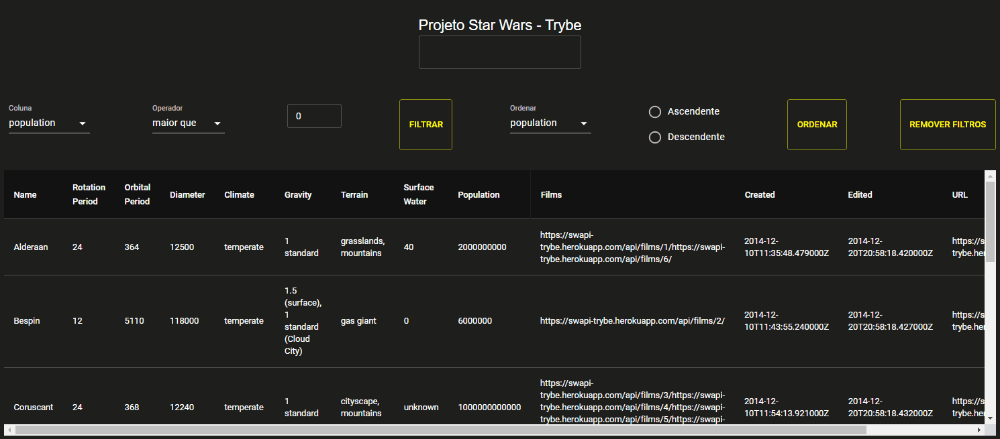
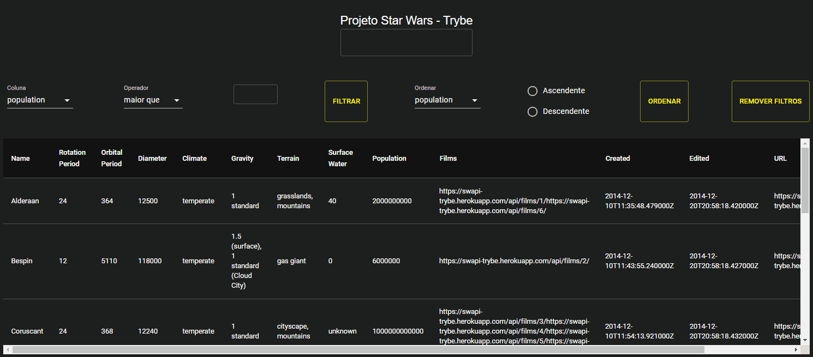

# Requisitos

## 1 - Faça uma requisição para o endpoint `/planets` da API de Star Wars e preencha uma tabela com os dados retornados, com exceção dos dados da coluna `residents`

<details><summary> Ilustração da tabela:</summary>

  
</details><br />

<details><summary> A tabela deve ser renderizada por um componente chamado <code>Table</code>:</summary>

  - Você deve apagar a coluna `residents` de cada planeta antes de salvar os dados recebidos da API no contexto.
  - A requisição deve ser feita em um componente separado do componente da tabela.
  - A API a ser consultada está [nesse link](https://swapi-trybe.herokuapp.com/api/planets/). Você deverá fazer um fetch para a URL `https://swapi-trybe.herokuapp.com/api/planets/`.
  - A primeira linha da tabela deve conter os headers de cada coluna. As demais linhas serão as informações de cada planeta recebido da API.
</details>
<br /><details>
  <summary><strong>O que será verificado</strong></summary><br />

- Realiza uma requisição para a API;
- Preenche a tabela com os dados retornados;
- Verifica se a tabela tem 13 colunas;
- Verifica se a tabela tem uma linha para cada planeta retornado.
</details>

---

## 2 - Crie um filtro de texto para a tabela
<details><summary> A tabela deve ser atualizada com os planetas que se encaixam no filtro à medida que o nome é digitado, sem ter que apertar em um botão para efetuar a filtragem. Por exemplo, se for digitado "Tatoo" no campo de texto, o planeta "Tatooine" deve ser exibido, como demonstrado na <b>ilustração</b>:</summary>

  
</details><br />

<details><summary>Observações técnicas</summary>

  - Você deve usar **Context API e Hooks** para fazer o gerenciamento do estado da aplicação;
  - O campo de texto deve possuir a propriedade `data-testid='name-filter'` para que a avaliação automatizada funcione;
  - <details><summary> O texto digitado deve ser salvo num campo <code>{ filterByName: { name } }</code>. Por exemplo:</summary>

    ```javascript
    {
      filterByName: {
        name: 'Tatoo'
      }
    }
    ```
  </details>
</details>


<br /><details>
  <summary><strong>O que será verificado</strong></summary><br />

- Renderiza o campo de texto para o filtro de nomes;
- Filtra os planetas que possuem a letra "o" no nome;
- Filtra planetas que possuem a letra "oo" no nome;
- Realiza os dois filtros acima em sequência e após, testa a remoção do filtro por texto.
</details>

---

## 3 - Crie um filtro para valores numéricos

<details><summary> O filtro funcionará com três seletores:</summary>

  - O primeiro deve abrir um dropdown que permita a quem usa selecionar uma das seguintes colunas: `population`, `orbital_period`, `diameter`, `rotation_period` e `surface_water`. Deve ser uma tag `select` com a propriedade `data-testid='column-filter'`;
  - O segundo deve determinar se a faixa de valor será `maior que`, `menor que` ou `igual a` o numero que virá a seguir. Uma tag `select` com a propriedade `data-testid='comparison-filter'`;
  - O terceiro deve ser uma caixa de texto que só aceita números. Essa caixa deve ser uma tag `input` com a propriedade `data-testid='value-filter'`;
  - Deve haver um botão para acionar o filtro, com a propriedade `data-testid='button-filter'`
</details>

<details><summary> A combinação desses três seletores, ao clicar no botão, deve filtrar os dados da tabela de acordo com a coluna correspondente e com os valores escolhidos. Por exemplo:</summary>

  - A seleção `population | maior que | 100000` - Seleciona somente planetas com mais de 100000 habitantes.
  - A seleção `diameter | menor que | 8000` - Seleciona somente planetas com diâmetro menor que 8000.
</details>

<details><summary><b>Ilustração do filtro:</b></summary>

  
</details><br />


<details><summary>Observações técnicas</summary>

  * Você deve usar **Context API e Hooks** para fazer o gerenciamento do estado da aplicação;
  * <details><summary> No contexto, esses valores devem ser salvos em um outro campo <code>{ filterByNumericValues: [{ column, comparison, value }] }</code>. Por exemplo:</summary>

    ```javascript
    {
      filterByNumericValues: [
        {
          column: 'population',
          comparison: 'maior que',
          value: '100000',
        }
      ]
    }
    ```
</details>

<br /><details>
  <summary><strong>O que será verificado</strong></summary><br />

- Renderiza o select de coluna e suas opções;
- Renderiza o select de comparação e suas opções;
- Renderiza o input para o valor do filtro;
- Renderiza o botão para executar a filtragem;
- Verifica se os valores iniciais de cada campo são (`population` | `maior que` | `0`);
- Utiliza o botão de filtrar sem alterar os valores iniciais dos inputs de filtro;
- Filtra utilizando a comparação "menor que";
- Filtra utilizando a comparação "maior que";
- Filtra utilizando a comparação "igual a".
</details>

---

## 4 - Implemente múltiplos filtros numéricos

<details><summary> Deverá ser possível adicionar múltiplos filtros numéricos. Todos os filtros adicionados devem funcionar de forma conjunta:</summary>

  
</details><br />

Por exemplo, você pode filtrar pelos planetas que possuam _Orbital period maior que 400_  **e** _Diameter menor que 10000_.

<br /><details>
  <summary><strong>O que será verificado</strong></summary><br />

- Adiciona dois filtros e verifica se a tabela foi atualizada com as informações filtradas;
- Adiciona três filtros e verifica se a tabela foi atualizada com as informações filtradas.
</details>

---

## 5 - Desenvolva testes para atingir 30% de cobertura total da aplicação

>:eyes: Observação: Neste requisito vamos cobrir a aplicação com testes unitários utilizando a biblioteca [React Testing Library](https://testing-library.com/docs/react-testing-library/intro/), aproveite essa oportunidade para colocar em prática o [Desenvolvimento Orientado por Testes](https://blog.betrybe.com/tecnologia/tdd-test-driven-development/).

<details><summary>Observações técnicas</summary>

  * Os testes criados por você não irão influenciar os outros requisitos no avaliador. Você deverá desenvolver seus testes unitários/integração usando a biblioteca React Testing Library, enquanto o avaliador usará a biblioteca [Cypress](https://docs.cypress.io/) para avaliar os requisitos, inclusive os de cobertura.
</details><br />

<br /><details>
  <summary><strong>O que será verificado</strong></summary><br />

  * Será validado se, ao executar `npm run test-coverage`, é obtido os seguintes resultados:
      * `% Stmts` da linha `All files` é maior ou igual a 30.
      * `% Branch` da linha `All files` é maior ou igual a 30.
      * `% Funcs` da linha `All files` é maior ou igual a 30.
      * `% Lines` da linha `All files` é maior ou igual a 30.
</details>

---

## 6 - Não utilize filtros repetidos

<details><summary> Caso um filtro seja totalmente preenchido, um novo filtro de valores numéricos deve ser carregado.</summary>

  * Este novo filtro não deve incluir quaisquer colunas que já tenham sido selecionadas em filtros de valores numéricos anteriores;
  * Caso todas as colunas já tenham sido inclusas em filtros anteriores, não deve ser carregado um novo filtro;
  * Você deve usar **Context API e Hooks** para fazer o gerenciamento do estado da aplicação.
</details>

<details><summary> Ilustração:</summary>

  
</details><br />

<details><summary> Exemplo:</summary>

  - O primeiro filtro tem as seguintes seleções: `population | maior que | 100000`;
  - Um segundo filtro deve aparecer após essas seleções serem todas feitas;
  - No primeiro dropdown deste segundo filtro, a opção `population` deve estar ausente;
  - <details><summary> Se no segundo filtro fosse selecionado `diameter | menor que | 8000`, o estado ficaria assim:</summary>

    ```javascript
    {
      filterByNumericValues: [
        {
          column: 'population',
          comparison: 'maior que',
          value: '100000',
        },
        {
          column: 'diameter',
          comparison: 'menor que',
          value: '8000',
        }
      ]
    }
    ```
  </details>


<br /><details>
  <summary><strong>O que será verificado</strong></summary><br />

- Filtra por população e remove a opção `population` das opções do dropdown de filtro por coluna.
</details>

---

## 7 - Apague um filtro de valor numérico ao clicar no ícone `X` de um dos filtros e apague todas filtragens numéricas simultaneamente ao clicar em outro botão de `Remover todas filtragens`

* <details><summary> O <code>button</code> que permite exclusão de um filtro deve existir em todos os filtros de valores numéricos:</summary>

  - Cada linha que demonstra o filtro já utilizado deve possuir a propriedade `data-testid='filter'`, com um `button` que deve ser filho direto da tag onde foi utilizado o `data-testid='filter'`;
  - Após a exclusão, a coluna que este filtro selecionava deve passar a ficar disponível nos dropdowns dos demais filtros já presentes na tela;
  - Você deve usar **Context API e Hooks** para fazer o gerenciamento do estado da aplicação.
  - <details><summary> Exemplo:</summary>

    ```html
    data-testid='filter'
        ⬑ column
        ⬑ comparison
        ⬑ value
        ⬑ button
    ```
  </details>
</details>


* O `button` de `Remover todas filtragens` deverá possuir o `data-testid='button-remove-filters'`. Este `button` será responsável pela remoção de todos os filtros numéricos simultaneamente.

<details><summary> Ilustração do requisito:</summary>

  
</details>

<br /><details>
  <summary><strong>O que será verificado</strong></summary><br />

- Adiciona um filtro e verifica se a tabela foi atualizada com as informações filtradas, depois remove o filtro e verifica se os valores da tabela voltaram ao original.
- Adiciona dois filtros e verifica se a tabela foi atualizada com as informações filtradas, depois remove os filtros e verifica se os valores da tabela voltaram ao original.
- Adiciona três filtros e verifica se a tabela foi atualizada com as informações filtradas, depois remove os filtros utilizando o botão `button-remove-filters` e verifica se os valores da tabela voltaram ao original.
</details>

---

## 8 - Desenvolva testes para atingir 60% de cobertura total da aplicação

<details><summary>Observações técnicas</summary>

  * Os testes criados por você não irão influenciar os outros requisitos no avaliador. Você deverá desenvolver seus testes unitários/integração usando a biblioteca React Testing Library, enquanto o avaliador usará a biblioteca [Cypress](https://docs.cypress.io/) para avaliar os requisitos, inclusive os de cobertura.
</details><br />

<br /><details>
  <summary><strong>O que será verificado</strong></summary><br />

  * Será validado se, ao executar `npm run test-coverage`, é obtido os seguintes resultados:
    * `% Stmts` da linha `All files` é maior ou igual a 60.
    * `% Branch` da linha `All files` é maior ou igual a 60.
    * `% Funcs` da linha `All files` é maior ou igual a 60.
    * `% Lines` da linha `All files` é maior ou igual a 60.
</details>

---

# Requisito Bônus

## 9 - Ordene as colunas de forma ascendente ou descendente

* A ordenação deve ser feita via filtro: um dropdown selecionará a coluna a basear a ordenação e um par de radio buttons determinará se é ascendente ou descendente.

* <details><summary> A informação acerca da ordenação das colunas deve ser armazenada em um novo campo <code>{ order: { column: 'population', sort: 'ASC'} }</code>:</summary>

  - O campo `column` representa o nome da coluna a ordenar;
  - O campo `sort` representa a ordenação, sendo 'ASC' ascendente e 'DESC' descendente;
</details>

* <details><summary> O dropdown deve ser um elemento <code>select</code>:</summary>

  - O `dropdown` precisa ter a propriedade `data-testid='column-sort'`;
  - <details><summary> As colunas selecionáveis através deste <code>dropdown</code> são:</summary>

    - 'population';
    - 'orbital_period';
    - 'diameter';
    - 'rotation_period';
    - 'surface_water'.
    </details>
</details>

* <details><summary> É necessário ter dois <code>inputs</code> de tipo <code>radio</code>:</summary>

  - O primeiro deve possuir o atributo `data-testid='column-sort-input-asc'` e `value` sendo `ASC`;
  - O segundo deve possuir o atributo `data-testid='column-sort-input-desc'` e `value` sendo `DESC`;
</details>

* :eyes: Caso a coluna ordenada possua planetas com valores `unknown`, você deverá ordená-los de forma que valores `unknown` ficarão em último lugar na ordenação.

* Por fim, crie um botão para submeter a ordenação, com uma tag `button` e a propriedade `data-testid='column-sort-button'`.

* Adicione o atributo `data-testid` com o valor `planet-name` em todos os elementos da tabela que possuem o nome de um planeta.

<details><summary><b> Ilustração do requisito:</b></summary>

  
</details>

<br /><details>
  <summary><strong>O que será verificado</strong></summary><br />

- Ordena os planetas do maior período orbital para o menor período orbital;
- Ordena os planetas do menor diâmetro para o maior diâmetro;
- Ordena os planetas do menos populoso para o mais populoso;
    - Verifica se os oito primeiros planetas estão ordenados corretamente;
    - Verifica se os dois últimos planetas possuem os valores unknown na coluna population.
- Ordena os planetas do mais populoso para o menos populoso;
    - Verifica se os oito primeiros planetas estão ordenados corretamente;
    - Verifica se os dois últimos planetas possuem os valores unknown na coluna population.

</details>

---

## 10 - Desenvolva testes para atingir 90% de cobertura total da aplicação

<details><summary>Observações técnicas</summary>

  * Os testes criados por você não irão influenciar os outros requisitos no avaliador. Você deverá desenvolver seus testes unitários/integração usando a biblioteca React Testing Library, enquanto o avaliador usará a biblioteca [Cypress](https://docs.cypress.io/) para avaliar os requisitos, inclusive os de cobertura.
</details><br />

<br /><details>
  <summary><strong>O que será verificado</strong></summary><br />

  * Será validado se, ao executar `npm run test-coverage`, é obtido os seguintes resultados:
    * `% Stmts` da linha `All files` é maior ou igual a 90.
    * `% Branch` da linha `All files` é maior ou igual a 90.
    * `% Funcs` da linha `All files` é maior ou igual a 90.
    * `% Lines` da linha `All files` é maior ou igual a 90.
</details>
